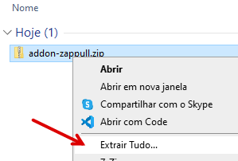
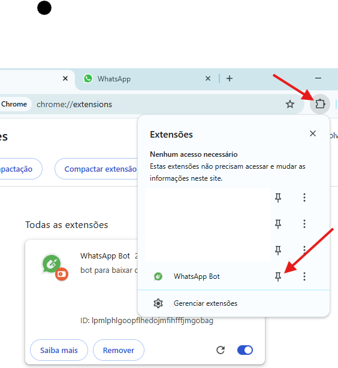
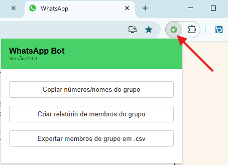

# Esse projeto foi descontinuado siga o novo projeto no repositório a baixo.

https://github.com/izidorio/zappull

### ZapPull

Uma extensão para o navegador Chrome e Edge que permite:

- Exportar em .csv os participantes dos grupos;
- Copiar os participantes para a área de transferência; e
- Montar um preview com as imagens, dados dos participantes e do grupo para impressão.

### Para instalar a extensão

1. Baixe o arquivo `addon-zappul.zip` [clicando aqui neste link](https://github.com/izidorio/zappull/releases/download/v2.0.6/zappull.zip)

2. Descompacte o arquivo baixado `addon-zappull.zip`.

   2.2 no windows clicar com o botão direito e selecionar a opção `extrair tudo` para descompactar o arquivo.
   

3. Abra o navegador Chrome ou Edge, na barra de endereço, para abrir o gerenciador de extensões do Chrome.

4. Habilite o Modo do desenvolvedor.

5. Carregue a extensão clicando no botão: `Carregar sem compactação` e depois selecione a pasta `addon-zappull` que você descompactou.

6. Click em Fixar na barra de ferramentas
   

## Como utilizar

Agora na página do WhatsApp Web pode abrir a extensão e selecionar um grupo e usar uma das opções no menu.
 

## License

Copyright (C) 2014 - 2020 <izidorio@bento.dev.br>

Permission is hereby granted, free of charge, to any person obtaining a copy of
this software and associated documentation files (the "Software"), to deal in
the Software without restriction, including without limitation the rights to
use, copy, modify, merge, publish, distribute, sublicense, and/or sell copies
of the Software, and to permit persons to whom the Software is furnished to do
so, subject to the following conditions:

The above copyright notice and this permission notice shall be included in all
copies or substantial portions of the Software.

THE SOFTWARE IS PROVIDED "AS IS", WITHOUT WARRANTY OF ANY KIND, EXPRESS OR
IMPLIED, INCLUDING BUT NOT LIMITED TO THE WARRANTIES OF MERCHANTABILITY,
FITNESS FOR A PARTICULAR PURPOSE AND NONINFRINGEMENT. IN NO EVENT SHALL THE
AUTHORS OR COPYRIGHT HOLDERS BE LIABLE FOR ANY CLAIM, DAMAGES OR OTHER
LIABILITY, WHETHER IN AN ACTION OF CONTRACT, TORT OR OTHERWISE, ARISING FROM,
OUT OF OR IN CONNECTION WITH THE SOFTWARE OR THE USE OR OTHER DEALINGS IN THE
SOFTWARE.
